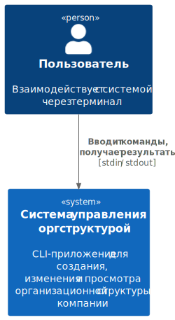
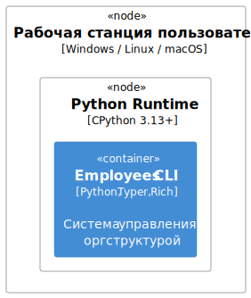

## 3. Контекст и область применения

### 3.1. Бизнес-контекст

На диаграмме ниже показаны границы системы и её взаимодействие с окружающим миром:

**Описание:**

| Аспект          | Значение                                                                                                     |
|-----------------|--------------------------------------------------------------------------------------------------------------|
| Пользователи    | Один тип — **Пользователь CLI**, взаимодействующий через терминал                                            |
| Внешние системы | **Отсутствуют**. Данные хранятся в оперативной памяти ([TC02](02_Constraints.md#21-технические-ограничения)) |
| Интерфейс       | Командная строка (`stdin` / `stdout`) через библиотеки Typer + Rich                                          |
| Протокол        | Пользователь вводит текстовые команды, получает таблицы/панели с результатом                                 |
| Границы системы | Всё, что находится внутри процесса Python — приложение. Всё за пределами — окружение                         |

Система полностью автономна: не зависит от внешних БД, API, файловых хранилищ или сетевых сервисов.
Единственный способ взаимодействия — ввод команд с клавиатуры и вывод результата в терминал.

### 3.2. Технический контекст

Упрощённая схема развёртывания (C4 Deployment) показывает, на каком оборудовании и в какой среде
исполняется приложение:

**Узлы развёртывания:**

| Узел                               | Роль                                                                                                                                        |
|------------------------------------|---------------------------------------------------------------------------------------------------------------------------------------------|
| **Рабочая станция пользователя**   | Физическая или виртуальная машина под управлением Windows, Linux или macOS. Никаких дополнительных серверов не требуется                    |
| **Python Runtime (CPython 3.13+)** | Среда исполнения на рабочей станции. Все компоненты приложения работают в одном процессе Python, без контейнеризации (Docker) и оркестрации |
| **Employees CLI**                  | Система управление оргструктурой                                                                                                            |

**Требования к развёртыванию:**

| Параметр              | Значение                                                                          |
|-----------------------|-----------------------------------------------------------------------------------|
| ОС                    | Windows / Linux / macOS                                                           |
| Рантайм               | CPython 3.13+                                                                     |
| Зависимости           | Устанавливаются через `pip install -e .` ([pyproject.toml](../../pyproject.toml)) |
| Сеть                  | Не требуется (полностью автономное приложение)                                    |
| Дисковое пространство | ~50 МБ (Python-рантайм + зависимости)                                             |
| Память                | Определяется объёмом данных в репозиториях (in-memory)                            |
| Запуск                | `python -m employees` — REPL-режим; `employees <команда>` — однократный запуск    |

Приложение не требует серверной инфраструктуры, СУБД, очередей сообщений или внешних API —
всё работает локально на машине пользователя в рамках одного процесса.
