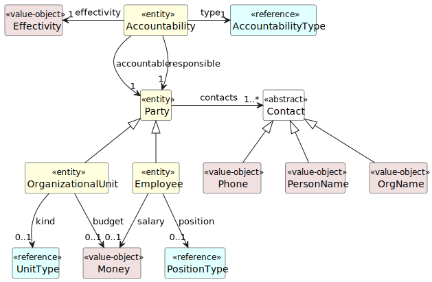

# Аналитический обзор приложения Employees
> **Кейс-задача № 4:** аналитический обзор проделанной работы в Кейс-задаче № 3.
---

## 1. Введение
Целью учебного задания была разработка (дословно) класса WORKER, 
подходящего в качестве модели для рассматриваемой организации.

Однако, ряд требований учебного задания (например, хранение данных между CRUD-операциями) 
требуют создания полноценного приложения.

В итоге было разработано CLI-приложение Employees, построенная по принципам Domain-Driven Design.
Ее доменная модель (центральная часть DDD-приложения) рассмотрена ниже.

### 1.1 Связанные документы
- [Оценка целевой организации](Оценка_целевой_организации.md) - исходные материалы для анализа
- [ARC42: Стратегия решения](../ARC42/04_Solution_Strategy.md) - технические принципы, согласно которым строилось приложение

## 2. Модель предметной области
### 2.1. Введение в модель
Модель предметной области создавалась на основе:
- требований из Кейс-задача №3: создать класс, описывающий работника некоторой организации,
- дополнительной учебной цели: описать внутреннюю структуру организации и возможность ее менять в процессе работы приложения

Основой для модели оргструктуры стал паттерн Accountability (Ответственность), 
описанный в книге Мартина Фаулера "Аналитические шаблоны".

Этот паттерн реализован в приложении лишь частично (потому что избыточен для реализации исходных требований), 
однако приложение можно доработать до полноценной его поддержки.

### 2.2. Диаграмма концептуальных классов (UML)

Диаграмма демонстрирует модель предметной области приложения.
Сущности на ней отмечены стереотипами, раскрывающими семантику.
Стереотипы:
- `entity` - собственно, сущность - концептуальный класс предметной области, идентифицируется по уникальному ключу,
- `value-object` - объект-значение, идентифицируется по значению всех полей,
- `reference` - элемент справочника, идентифицируется по ключу и/или коду справочника

### 2.3. Сущности

| Сущность               | Назначение                                                                 | Статус          |
|------------------------|----------------------------------------------------------------------------|-----------------|
| `Employee`           | Сотрудник компании: ФИО, телефон, зарплата, код должности, период действия | Реализован      |
| `PositionType`       | Справочник должностей: код, название, описание, период действия            | Реализован      |
| `OrganizationalUnit` | Подразделение (отдел, департамент, команда)                                | Заглушка (FR05) |
| `AccountabilityType` | Тип отношения ответственности в оргструктуре                               | Заглушка (FR06) |
| `UnitType`           | Тип подразделения                                                          | Заглушка (FR06) |

Идиомы модели:
- Все сущности (entity) наследуют от абстрактного базового класса `Entity` уникальный ключ `ID`.
- Класс `Employee` наследник класса `Party`, представляющего абстрактного участника организационной структуры.
- Класс `Party` содержит коллекцию (1 или более) контактов (`contacts`): ФИО, номер телефона, реквизиты и т.п. 
представленные абстрактным классом `Contact` (и его фактическими наследниками). 
- Позиция (`position`) сотрудника (`Employee`) задана справочником `PositionType`.
- Зарплата сотрудника (`salary`) задана объектом-значением `Money`.
- Время действия элемента справочника (`PositionType`) ограничено интервалом даты/времени `Effectivity`.

### 2.4 Объекты-значения
Объекты-значения неизменяемы, инкапсулируют валидацию и не имеют собственного идентификатора:

| Объект-значение | Поля                                                             | Назначение                             |
|-----------------|------------------------------------------------------------------|----------------------------------------|
| `PersonName`  | `last_name`, `first_name`, `middle_name`, `full_name` (property) | ФИО сотрудника                         |
| `Phone`       | `number`                                                         | Телефонный номер                       |
| `Money`       | `amount` (Decimal >= 0), `currency` (ISO 4217, default RUB)      | Денежное значение                      |
| `Effectivity` | `effective_from`, `effective_to` (Optional), `is_active(at)`     | Период действия с проверкой хронологии |
| `OrgName`     | `name`                                                           | Наименование организации               |

Замена «года поступления» (см. учебное задание) на `Effectivity` - осознанное архитектурное решение, 
обеспечивающее историчность данных (сотрудник может менять должность и подразделение с течением времени).

## 3. Функции
Функциональность приложения организована через паттерн Command, вызываемые через CLI: 
каждый сценарий использования - отдельный класс-наследник `UseCase` в пакете `src/employees/application/usecases/`.

### 3.1 CLI-команды

#### 3.1.1. Employees - управление сотрудниками

| Команда  | Класс            | Описание                  |
|----------|------------------|---------------------------|
| `create` | `EmployeeCreate` | Создать сотрудника        |
| `list`   | `EmployeeList`   | Постраничный список       |
| `show`   | `EmployeeShow`   | Детальный просмотр по ID  |
| `update` | `EmployeeUpdate` | Диалоговое редактирование |
| `delete` | `EmployeeDelete` | Мягкое удаление           |
| `tenure` | `EmployeeTenure` | Фильтр по стажу > N лет   |

#### 3.1.2. Positions - управление справочником должностей

| Команда  | Класс            | Описание                   |
|----------|------------------|----------------------------|
| `create` | `PositionCreate` | Создать позицию            |
| `list`   | `PositionList`   | Постраничный список        |
| `show`   | `PositionShow`   | Детальный просмотр по коду |
| `update` | `PositionUpdate` | Диалоговое редактирование  |
| `delete` | `PositionDelete` | Мягкое удаление            |

## 4. Инкапсуляция
Инкапсуляция в приложении реализована на пяти уровнях, защищая данные, ввод-вывод и зависимости.

### 4.1 Валидация доменных данных (Pydantic)
Применение Pydantic, аннотаций полей и методов-инвариантов (`model_validator`) гарантирует, что любое изменение поля проходит валидацию.

### 4.2 Инкапсуляция хранилища (Repository)
Внутреннее in-memory хранилище скрыто за интерфейсом репозитория. 
Доменные исключения (`EntityNotFoundError`, `DuplicateEmployeeError`, `DuplicateCodeError`) заменяют 
коды ошибок и, делая поток управления явным.

### 4.3 Инкапсуляция ввода-вывода (Printable / Reader)
Команды не знают, куда идёт вывод и откуда приходит ввод.
Реализация внедряется через IoC-контейнер.
Это позволяет заменять ввод-вывод в тестах на тестовые заглушки.

## 5. Тестирование
Ниже - план ручной проверки всех реализованных функций (FR01-FR04). 

### 5.1 Справочник должностей (FR04)

| №   | Функция           | Что проверять                             | Способ ручной проверки                                                                           |
|-----|-------------------|-------------------------------------------|--------------------------------------------------------------------------------------------------|
| P1  | `position create` | Успешное создание                         | `employees position create --code DEV --name "Разработчик"`                                      |
| P2  | `position create` | Дубликат кода                             | Повторить P1. Ожидается: ошибка «уже существует»                                                 |
| P3  | `position create` | Некорректный код (кириллица/пробел)       | `--code "Разраб" --name "Тест"`. Ожидается: ошибка валидации                                     |
| P4  | `position create` | Пустое название                           | `--code TEST --name ""`. Ожидается: ошибка валидации                                             |
| P5  | `position create` | Период действия (прошлое)                 | `--code HIST --name "Историческая" --effective-from 2020-01-01 --effective-to 2023-12-31`        |
| P6  | `position create` | Некорректный период (конец раньше начала) | `--code BAD --name "X" --effective-from 2025-01-01 --effective-to 2024-01-01`. Ожидается: ошибка |
| P7  | `position list`   | Список с пагинацией                       | `employees position list`. Все созданные позиции отображаются                                    |
| P8  | `position show`   | Детальный просмотр                        | `employees position show --code DEV`. Все поля панели корректны                                  |
| P9  | `position show`   | Несуществующий код                        | `employees position show --code NOPE`. Ожидается: «не найден»                                    |
| P10 | `position update` | Диалоговое редактирование                 | `employees position update --code DEV` → изменить название → проверить через `position show`     |
| P11 | `position delete` | Мягкое удаление                           | `employees position delete --code HIST` → `position show --code HIST`. Ожидается: «не найден»    |
| P12 | `position delete` | Несуществующий код                        | `employees position delete --code NOPE`. Ожидается: «не найден»                                  |

### 5.2 Сотрудники (FR01, FR02)

| №   | Функция           | Что проверять                  | Способ ручной проверки                                                                                                                       |
|-----|-------------------|--------------------------------|----------------------------------------------------------------------------------------------------------------------------------------------|
| E1  | `employee create` | Успешное создание              | `employees employee create --last-name Иванов --first-name Пётр --middle-name Сергеевич --phone +79111234567 --salary 150000 --position DEV` |
| E2  | `employee create` | Без отчества                   | `... --last-name Петров --first-name Анна --phone +79219876543 --salary 120000 --position DEV`                                               |
| E3  | `employee create` | Дубликат (те же ФИО + телефон) | Повторить E1. Ожидается: ошибка «уже существует»                                                                                             |
| E4  | `employee create` | Несуществующая должность       | `... --position BAD_CODE`. Ожидается: ошибка «позиция не найдена»                                                                            |
| E5  | `employee create` | Отрицательная зарплата         | `... --salary -1000`. Ожидается: ошибка                                                                                                      |
| E6  | `employee create` | Некорректная зарплата          | `... --salary abc`. Ожидается: ошибка «должна быть числом»                                                                                   |
| E7  | `employee create` | Пустая фамилия                 | `... --last-name ""`. Ожидается: ошибка валидации                                                                                            |
| E8  | `employee create` | Период в прошлом (действующий) | `... --effective-from 2018-06-01`. Статус: «действует»                                                                                       |
| E9  | `employee create` | Бывший сотрудник               | `... --effective-from 2020-01-01 --effective-to 2024-12-31`. Статус: «не действует»                                                          |
| E10 | `employee list`   | Список с пагинацией            | Создать 25+ сотрудников, `employees employee list --page 1 --page-size 10`                                                                   |
| E11 | `employee list`   | Пустой список                  | В чистом хранилище `employee list`. Ожидается: «список пуст»                                                                                 |
| E12 | `employee show`   | Детальный просмотр             | `employees employee show --id 1`. Все поля панели корректны                                                                                  |
| E13 | `employee show`   | Несуществующий ID              | `employees employee show --id 99999`. Ожидается: «не найден»                                                                                 |
| E15 | `employee update` | Изменение зарплаты             | `employee update --id 1` -> 5 200000 -> Enter -> проверить                                                                                   |
| E16 | `employee update` | Снятие даты окончания          | `employee update --id <бывшего>` -> 8 "" -> проверить: статус сменился на «действует»                                                        |
| E17 | `employee update` | Некорректный номер поля        | `employee update --id 1` -> 99 что-то. Ожидается: «нет поля»                                                                                 |
| E18 | `employee delete` | Мягкое удаление                | `employees employee delete --id 1` -> `employee show --id 1`. Ожидается: «не найден»                                                         |
| E19 | `employee delete` | Несуществующий ID              | `employees employee delete --id 99999`. Ожидается: «не найден»                                                                               |

### 5.3 Фильтр по стажу (FR03)

| №  | Функция           | Что проверять             | Способ ручной проверки                                                                                              |
|----|-------------------|---------------------------|---------------------------------------------------------------------------------------------------------------------|
| F1 | `employee tenure` | Фильтр — есть результаты  | Создать сотрудника с `--effective-from 2018-01-01`, затем `employees employee tenure --years 5`. Сотрудник в списке |
| F2 | `employee tenure` | Сортировка по возрастанию | `employees employee tenure --years 0 --sort up`                                                                     |
| F3 | `employee tenure` | Сортировка по убыванию    | `employees employee tenure --years 0 --sort down`                                                                   |
| F4 | `employee tenure` | Нет результатов           | `employees employee tenure --years 50`. Ожидается: «Нет сотрудников со стажем более 50 лет»                         |
| F5 | `employee tenure` | Пагинация                 | Создать 30+ сотрудников со стажем, `employee tenure --years 0 --page 2`                                             |

## 6. Документация
В качестве шаблона архитектурной документации выбран ARC42.
Структура дополнительных документов, которые не предусмотрены ARC42, взята из Rational Unified Process. 

| Документ                       | Содержание                                                                            |
|--------------------------------|---------------------------------------------------------------------------------------|
| **ARC42: Введение и цели**     | Концепция системы, FR01–FR07, NFR, стейкхолдеры                                       |
| **ARC42: Ограничения**         | Технические (Python, Typer, in-memory) и организационные                              |
| **ARC42: Контекст и границы**  | Внешние интерфейсы, бизнес-контекст                                                   |
| **ARC42: Стратегия решения**   | 15 архитектурных решений с мотивацией                                                 |
| **C4: System Context**         | Диаграмма системного контекста (PlantUML + SVG)                                       |
| **C4: Technical Context**      | Диаграмма технического контекста (PlantUML + SVG)                                     |
| **CDM: Domain Model**          | Концептуальная модель данных (PlantUML)                                               |
| **Оценка целевой организации** | Описание Nedra Digital (КЗ-1, КЗ-2)                                                   |

## 7. Итерация

### 7.1 Roadmap дальнейших улучшений
Доработать приложение для полноценной поддержки оргструктуры.
Например, сотрудник может иметь руководителя и собственных подчиненных, а так же числиться в отделе, 
принадлежащим департаменту, а тот - головной компании. Далее можно получить исторический срез: 
кто, когда и куда переводился внутри организации, 
и как сама организация и ее подразделения меняли свою структуру подчинения.
